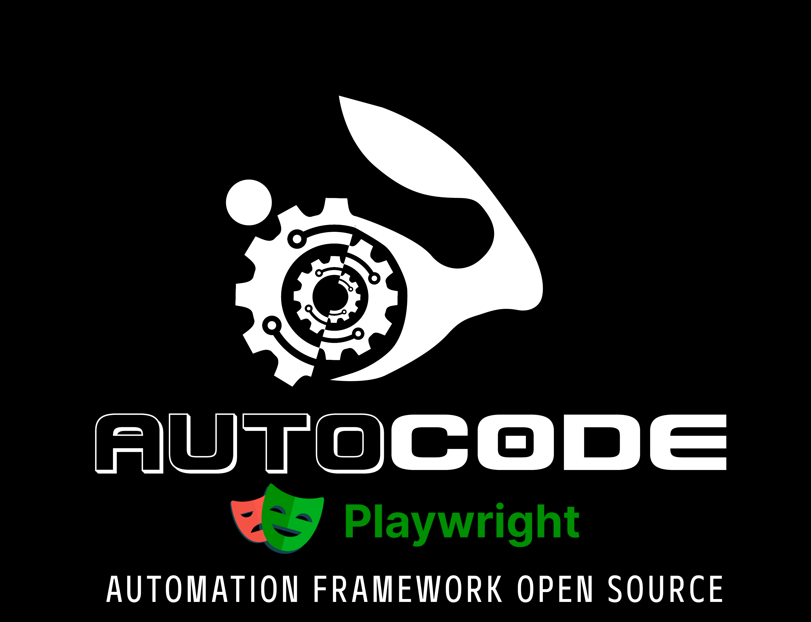

[](https://choosealicense.com/licenses/mit/)


# Hi, I'm Joel! 👋


# Autoc0de - Playwrigth



## _Open source tests automation framework for Web aplications with Playwrigth_

# Indice

In this README.MD we will see the following topics:

- What can we do with this Framework
- What technologies are incorporated (Technological Stak)
- Project architecture
- Tools needed to run it locally and Steps to run the Framework
- How to change the suite to be run
- How to see a great Report
- How to configurate Autoc0de for your web app

## What can we do with this Framework

- Add playable code for browser web apps
- Run a Playwrigth codegen for obtain code for your tests
- Automate in **BDD** using **Gherkin** language
- Obtain at the end of each execution, two types of reports **(ExtentReport, and Cucumber Basic Report)**
- Use the framework's own functions to streamline repetitive tasks
- Execution **sequential**
- More easy manage all the locators with the features of Playwrigth

## Features to add in the future

- Change the @Tag of the suite in pom.xml (Change in ```TestRunner.class``` for now)
- Add Parallel execution of tests

This framework is maked based on several technologies that are detailed in the next point. All open source

## Technological Stak

This Framework includes the following technologies:

- [Maven] - Java project management and construction tool (Latest)
- [Java] - OO programming language. (JDK 20 - latest)
- [Playwright] - Automation tool Web, Mobile, API.
- [Cucumber] - Herramienta que nos permite generar scripts de prueba utilizando tests cases escritos en Gherkin **(Archivos.feature)**.
- [Gherkin] - Tool that allows us to generate tests scripts using tests cases written in Gherkin **(Files.feature)**.
- [Extent Report] - Intuitive reporter and very nice to look at.
- [JUnit] - Automation tool that will allow us to create Runners and use notations.

**IDE recommended**
- [IntelliJ] - Excellent Ide for automation development (Latest)

**Recommended plugins for IntelliJ**
- **Gherkin**
- **Cucumber for Java**

The technologies mentioned above are integrated into the framework through MAVEN in the **pom.xml** file. The versions are specified below:

| Technology                      | Maven version |Link Maven repo                                                                    |
|---------------------------------|---------------|-----------------------------------------------------------------------------------|
| Playwright Main Library         | 1.34.0        |https://mvnrepository.com/artifact/com.microsoft.playwright/playwright             |
| JUnit maven                     | 7.8.1         |https://mvnrepository.com/artifact/io.cucumber/cucumber-junit                      |
| Cucumber-java                   | 7.8.1         |https://mvnrepository.com/artifact/io.cucumber/cucumber-java                       |
| Cucumber-core                   | 7.8.1         |https://mvnrepository.com/artifact/io.cucumber/cucumber-core                       |
| Extent Report Adapter 7         | 1.9.0         |https://mvnrepository.com/artifact/com.aventstack/extentreports                    |
| SLF4J LOG4J 12                  | 2.0.3         |https://mvnrepository.com/artifact/org.slf4j/slf4j-log4j12                         |
| SLF4J API                       |2.0.3          |https://mvnrepository.com/artifact/org.slf4j/slf4j-api                             |
| ExtentReports Cucumber7 Adapter | 1.9.0         |https://mvnrepository.com/artifact/tech.grasshopper/extentreports-cucumber7-adapter|

**Remember to keep these versions of Maven up to date as much as possible. If the project ever stops working, it could be because one of the versions found here has been deprecated / moved. However, it must be remembered that at the date this project was uploaded, all versions are the most current**

## Framework architecture

This Framework uses the automation pattern [Page Object] and is structured as follows.


```
   
└── src
    ├── main
    │   └── java      
    │       └── com.core       
    │           ├── hooks  ------------------------------> Folder where our Hooks are stored            
    │           │   └── Hook.class ----------------------> Framework hook
    │           └── utility -----------------------------> Folder with useful functions
    │               └──── MasterPage.class ----------------> MasterPage with generic functions adapt to work with Locator Builder  
    │          
    │   
    └── test
    │   ├── java   
    │   │   └── com.autoc0de
    │   │       ├── locators
    │   │       │   └── ExampleLocators.class
    │   │       ├── pages -------------------------------> Folder where our Pages are stored
    │   │       │   └── ExamplePage.class ---------------> Example of a page
    |   |       ├── runner
    |   |       |   ├── TearDown.class ------------------> Class with trarDown method
    |   |       |   └── TestRunner.class ----------------> Runner fo the automated tests with JUnit
    │   │       └── steps -------------------------------> Folder where our Pages are stored
    │   │           └── ExampleSteps.class --------------> Example of a step definition  
    │   └── resources           
    │       ├── features --------------------------------> Folder where out features files are stored
    │       │   └── Example.features --------------------> Example of a feature file
    │       ├── extent.properties -----------------------> Report properties
    │       └── extent-config.xml -----------------------> Report config
    └── pom.xml -----------------------------------------> POM File of this framework    
```

This project is based on 4 levels:
* **Page objects** (They are all our pages that in this case, are in the folder ```pages```)
* **Step definitions** (They are all the definitions of our steps written in [Gherkin], in this case, in the folder ```steps```)
* **Locatorss** (Here we find all the locators defined with the format of the Locator Builder, in this case, in the folder ```locators```)
* **Features** (These are all our .features files written in [Gherkin], in this case, in the folder ```features```)

## Tools needed to run it locally and Steps to run the Framework

In the ```Technological Stack``` section, we will find links that will take us to the websites to download all the tools we need. However, when using maven, we only need to install:
* Maven 3.9.1 minimal (The latest work fine too)
* Java
* JDK

1. Install Maven 3.9.3
2. Install Java and JDK (Greater 20.0.1 or latest)
3. Expose Maven and Java in environment variables (M2_HOME and JAVA_HOME)
4. Inside the root path of the newly cloned project, open the console and execute the following maven command: ```mvn install -DskipTests```. This will download all the necessary dependencies found in the ```pom.xml``` file

Once we have everything we need installed, to run the project we have 2 options:
* Inside the project with an ide (IntelliJ for example), select the file ```TestRunner.class```, right click on it, option **"Run"**
* Open console within the path of the newly cloned project and execute the following maven command ```mvn clean install tests```

At this time we should be running the automatic tests on Google chrome browser (Chromium)

7. When the execution finishes, we go to the folder ```target / Reports``` where we will find the ExtentReport report called``` ExtentReport-HTML.html``` and ```index.html```
8. Finally, if we wish, we execute the maven command ```mvn clean``` to delete the folder ```target``` and all its content

## How to change the Suite that is going to be executed

To change the scenario we want to run, we have to modify the ```@Tag``` of [Cucumber] in the file ```TestRunner``` indicated in the following images:

```File TestRunner.class```

<p align="center">
  
</p>

Remember that the ```@tag``` that we are going to replace has to be identical in both files, and it has to exist within the feature that we want to execute, for example:

```File Feature.feature```

<p align="center">
  
</p>

## How to see a great Report

If we want to see the report, prior to the execution of the project, we have to go to the ```Target``` folder that is automatically generated in the project structure.

```
  
└── src
└── Target
    ├── cucumber-reports -------------------> In this folder we found a basic cucumber report
    ├── generated-test-sources
    └── Reports ----------------------------> in this folder we found 2 type of reports 
    │   ├── ExtentReport-HTML.html ---------> Greater report of Extent Report
    │   └── index.html ---------------------> Greater report of Extent Report
    └── test-clases
```

It is as simple as looking for it, opening it with a browser and viewing it

* Extra Feature:
    * **Screenshots**: If in our test we have errors, Autoc0de Plauwrigth will automatically generate a screenshot at the exact moment the execution failed.

  Examples:
<p align="center">
Example of dashboard of our Report
</p>
<p align="center">
  
</p>
<p align="center">
Example of status of our steps
</p>
<p align="center">
  
</p>
<p align="center">
Example of a screenshot taked when the execution of test fail
</p>
<p align="center">
  
</p>
<p align="center">
Example of a exeption captured by the report
</p>
<p align="center">
  
</p>
<p align="center">
Example of the enviroment and system information
</p>
<p align="center">
  
</p>

## How to configurate Autoc0de for your web aplication

If you want to use this Framework to automate your own web application (of course), you only have to follow the steps that I leave you below. Let's go to that


1. Open the ```pom.xml``` file that is in the root of the project, then, look for it property called ```<applicationUrl> https://underc0de.org/ </applicationUrl>``` and replace that address with that of your web application

<p align="center">
  
</p>


2. Look for the file called ```TestRunner.class``` (See architecture) and locate the ```@Tag``` located in the ```'tags'``` option. Replace ```@ExampleTag``` with the desired tag

<p align="center">
  
</p>

3. Now, add your features files in the folder ```features```, yout step definition in the folder ```steps```, and yout constants and functions in the folder ```pages```

4. Done!, now run on a terminal the comand: ```mvn clean test``` (Or click on ```TestRunner.class``` ---> ```run```) and your project was run!

# Enjoy!


## Architect, creator and developer of the framework
```sd
    * Joel Vitelli
```
## Distributed by
```sd
    * Underc0de.org
```

## Contributing Developers
```sd
    * Danilo Vezzoni    
```


[Maven]: <https://maven.apache.org/download.cgi>
[Java]: <https://https://www.oracle.com/java/technologies/javase/jdk20-archive-downloads.html>
[Playrigth]: <https://https://playwright.dev/java/docs/intro>
[Cucumber]: <https://cucumber.io/>
[Gherkin]: <https://cucumber.io/docs/gherkin/reference/>
[Extent Report]: <https://www.extentreports.com/>
[JUnit]: <https://https://junit.org/junit5/>
[IntelliJ]: <https://www.jetbrains.com/idea/>
[Page Object]: <https://www.tutorialselenium.com/2019/02/05/page-object-model-selenium-webdriver/>
[Google Chrome]: <https://www.google.com/intl/es-419/chrome/>


## 🚀 About Me
I'm a full stack automation developer. I love support the comunity and create new tools for automation!


## 🔗 Links
[](https://github.com/Joel-Vitelli)
[](https://www.linkedin.com/in/joel-vitelli/)


